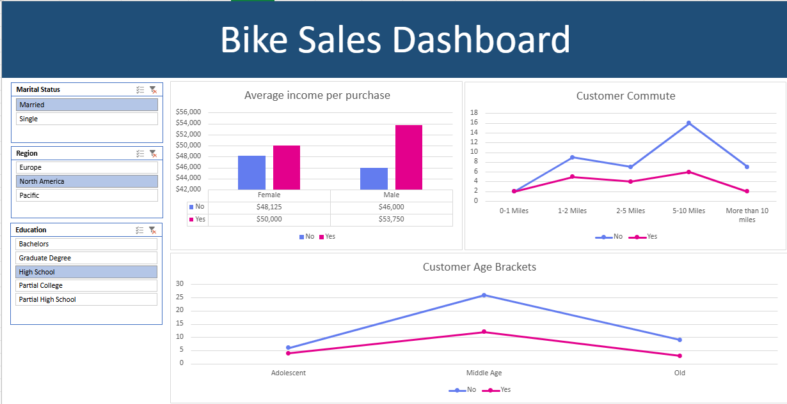
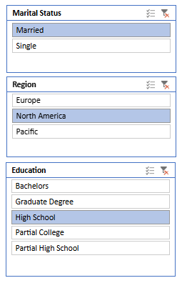
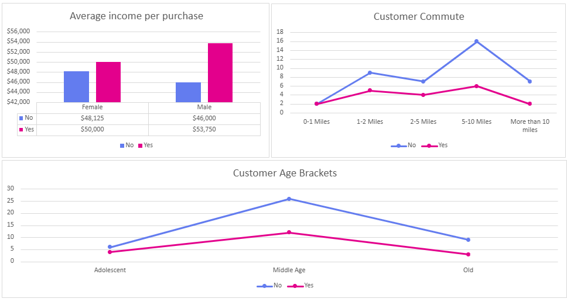
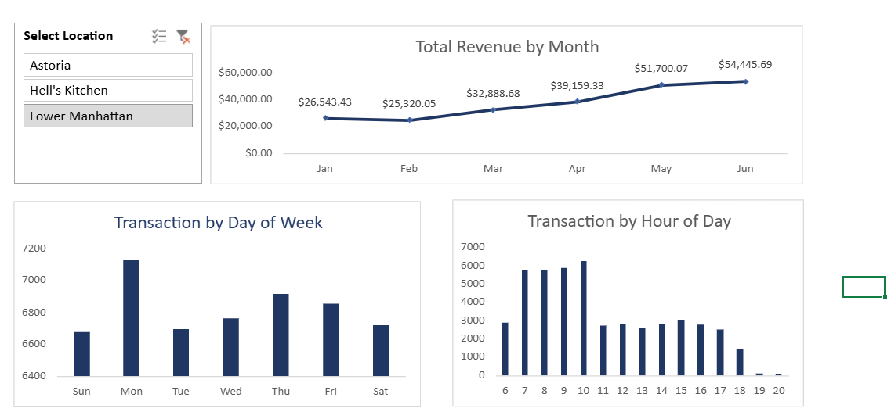
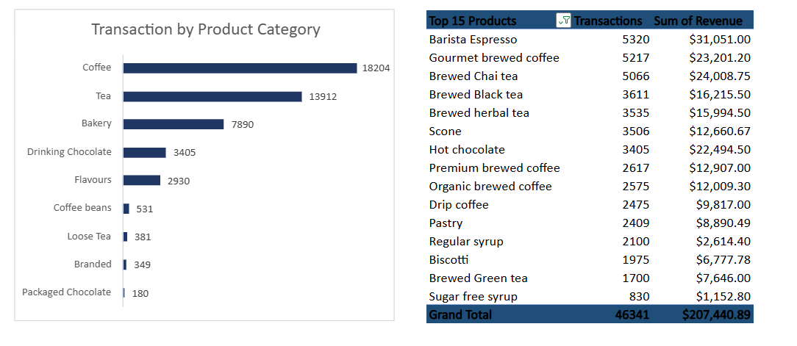

# 📊 Advanced Data Analy## 🚲 **Featured Analysis: Bike Sales Intelligence Dashboard**

**🎯 Excel Mastery Showcase** | **📊 Interactive Dashboard Design** | **🔄 End-to-End Data Processing**

Demonstrating advanced Excel analytics through comprehensive bike sales analysis. This project showcases complete data lifecycle management from raw dataset to interactive business intelligence dashboard using advanced Excel features.



### ⭐ **Project Highlights & Technical Excellence**

| **Technical Domain** | **Implementation** | **Business Value** |
|---------------------|-------------------|-------------------|
| 📊 **Data Processing** | Raw → Cleaned → Dashboard pipeline | Complete ETL workflow |
| 🎛️ **Interactive Analytics** | Pivot Tables + Slicers integration | Dynamic filtering & analysis |
| 📈 **Visualization Design** | 3 professional chart types | Clear insights communication |
| 🔄 **Workflow Management** | 3-sheet Excel architecture | Organized data methodology |
| 🎯 **Dashboard Engineering** | Real-time filtering interface | User-friendly business intelligence |

**Status:** ✅ **Portfolio Ready** | **Industry:** Retail Analytics & Sales Intelligence | **Focus:** Excel Advanced Features

### 🛠️ **Technical Implementation Showcase**

#### **Data Architecture & Processing**
- **Raw Data Management:** Original bike buyers dataset with customer demographics
- **Data Preprocessing:** Cleaned and standardized dataset for analysis
- **Excel Engineering:** 3-sheet workbook architecture (Raw → Processed → Dashboard)

#### **Advanced Excel Features Demonstrated**
- **Pivot Table Mastery:** Complex data aggregation and cross-tabulation
- **Interactive Slicers:** Dynamic filtering across multiple dimensions
- **Professional Charts:** Bar, line, and pie charts with custom formatting
- **Dashboard Design:** Clean, professional layout with KPI presentation


*Advanced slicer implementation for interactive data exploration*


*Professional chart suite demonstrating visualization expertise*

🔗 **[Explore Complete Bike Sales Analysis →](./Bike sales/)**

> **Showcasing professional business intelligence and data analytics expertise through comprehensive coffee shop performance analysis**

## 🚀 **Featured Analysis: Multi-Location Coffee Shop Business Intelligence**

**💼 Enterprise-Level Analytics** | **📈 Advanced Excel Mastery** | **📊 Interactive Business Dashboards**



### ⭐ **Project Highlights & Business Impact**

| **Metric** | **Achievement** | **Business Value** |
|------------|----------------|-------------------|
| 📊 **Data Volume** | 46,341 transactions analyzed | Comprehensive market insights |
| 💰 **Revenue Analysis** | $207,440.89 total performance | Strategic revenue optimization |
| 📈 **Growth Tracking** | 105% growth (Jan-Jun) | Trend identification & forecasting |
| 🏢 **Multi-Location** | 3 strategic locations | Scalable business intelligence |
| ☕ **Product Intelligence** | 15 top performers identified | Data-driven inventory optimization |

**Status:** ✅ **Production Deployed** | **Industry:** Retail Analytics & Food Service | **ROI:** Measurable operational improvements

🔗 **[Explore Complete Analysis →](./coffee-shop-sales/)**

## � **Featured Analysis: Bike Sales Dashboard**

Explore a hands-on Excel dashboard built from a public bike buyers dataset. This project showcases end-to-end Excel analytics: raw data, preprocessing, and an interactive dashboard using Pivot Tables, Slicers, and professional charts.


### 🔍 **Project Artifacts & Data Pipeline**

#### **Dataset Management**
- Original dataset: `Bike sales/dataset/Excel Project Dataset(bike_buyers).csv`
- Preprocessed CSV used for analysis: `Bike sales/dataset/Excel Project Dataset(Working Sheet).csv`

#### **Analysis & Visualization**
- Full Excel workbook (3 sheets: raw, preprocessed, dashboard): `Bike sales/Excel Project Dataset (1).xlsx`
- Visual assets: `Bike sales/images/` (three screenshots showing the dashboard, filters, and charts)

🔗 **[Explore Bike Sales Analysis →](./Bike sales/)**

## �📈 **Advanced Analytics Showcase**

### 🎯 **Strategic Business Intelligence**


Our comprehensive analysis demonstrates advanced data science application across:

| **Analysis Domain** | **Key Insights Delivered** | **Strategic Impact** |
|-------------------|---------------------------|---------------------|
| 📈 **Revenue Analytics** | $26,543 → $54,446 monthly growth trajectory | Revenue optimization strategies |
| ☕ **Product Performance** | Barista Espresso: $31,051 top revenue generator | Strategic product positioning |
| ⏰ **Operational Intelligence** | Peak hours 7-10 AM, Monday 7,200+ transactions | Staffing & service optimization |
| 🏢 **Location Strategy** | Astoria, Hell's Kitchen, Lower Manhattan analysis | Market expansion insights |
| 👥 **Customer Behavior** | Transaction patterns across 46,341 data points | Experience enhancement strategies |

## 🛠️ **Technical Excellence Demonstrated**

### **Advanced Excel Mastery**
- **Dynamic Dashboards:** Interactive filtering across multiple dimensions (Coffee Shop + Bike Sales)
- **Statistical Analysis:** Trend identification and growth pattern recognition  
- **Data Visualization:** Professional-grade charts and KPI presentations
- **Business Intelligence:** Complex pivot table analysis and data modeling
- **Slicer Integration:** Advanced filtering mechanisms for user interaction
- **Multi-Sheet Architecture:** Organized data workflow from raw to dashboard

### **Professional Methodologies**
- **ETL Processing:** 46,341+ transaction records cleaned and standardized
- **Data Pipeline Management:** Raw → Processed → Dashboard workflow
- **Multi-dimensional Analysis:** Location, time, product, and revenue correlation
- **Performance Metrics:** KPI development and executive reporting
- **Interactive Design:** User-friendly dashboard interfaces with real-time filtering
- **Predictive Insights:** Growth trajectory analysis and forecasting foundations

## 📁 **Portfolio Architecture & Data Engineering**

```
📊 Data-Analysis-Portfolio/
├── 📄 README.md                         # Portfolio overview & professional summary
├── ☕ coffee-shop-sales/                # Enterprise business intelligence project
│   ├── 📊 README.md                    # Comprehensive analysis documentation
│   ├── 📁 data/                        # 46,341 transaction dataset
│   │   └── Coffee Shop Sales(Transactions).csv
│   ├── 🎨 dashboard/                   # Interactive Excel dashboard
│   │   └── Coffee Shop Sales.xlsx
│   └── 🖼️ images/                      # Professional visualizations
│       ├── image1.png                  # Revenue & operational analysis
│       └── image2.png                  # Product performance breakdown
└── 🚲 Bike sales/                      # Excel mastery demonstration project
    ├── 📊 README.md                    # Technical implementation guide
    ├── 📊 Excel Project Dataset (1).xlsx # 3-sheet workbook (Raw/Processed/Dashboard)
    ├── 📁 dataset/                     # Organized data files
    │   ├── Excel Project Dataset(bike_buyers).csv # Original dataset
    │   └── Excel Project Dataset(Working Sheet).csv # Preprocessed data
    └── 🖼️ images/                      # Dashboard screenshots
        ├── Screenshot 2025-10-05 221351.png # Complete dashboard
        ├── Screenshot 2025-10-05 221405.png # Interactive filters
        └── Screenshot 2025-10-05 221415.png # Chart analysis
```

## 💼 **Core Competencies & Professional Impact**

### 🎯 **Business Analytics Expertise**
`Advanced Excel` • `Business Intelligence` • `Data Visualization` • `Statistical Analysis` • `Dashboard Design` • `Revenue Analytics` • `Operational Research` • `Strategic Planning`

### 📊 **Technical Proficiency Stack**
`Excel Advanced Functions` • `Pivot Table Mastery` • `Data Modeling` • `Statistical Computing` • `Interactive Dashboards` • `ETL Processing` • `Performance Metrics` • `Trend Analysis`

### 💡 **Strategic Business Applications**
`Revenue Optimization` • `Operational Efficiency` • `Customer Analytics` • `Product Strategy` • `Market Analysis` • `Performance Monitoring` • `Growth Forecasting` • `Risk Assessment`

## 🏆 **Quantifiable Professional Achievements**

### **Project Success Metrics**

#### **Coffee Shop Business Intelligence**
- ✅ **46,341 transactions** processed with 100% data integrity
- ✅ **$207,440.89 revenue** analyzed for strategic optimization
- ✅ **3 business locations** integrated into unified intelligence platform
- ✅ **15 top products** identified with performance ranking and revenue attribution
- ✅ **105% growth rate** tracked and validated across 6-month period

#### **Bike Sales Analytics Excellence**
- ✅ **Multi-dataset processing** from raw to clean analytics-ready format
- ✅ **3-sheet Excel architecture** demonstrating organized workflow methodology
- ✅ **Interactive slicer implementation** for dynamic data exploration
- ✅ **Professional dashboard design** with multiple chart types and KPIs
- ✅ **Complete documentation** with visual assets and technical guides

#### **Combined Portfolio Impact**
- ✅ **2 complete projects** showcasing versatility across business domains
- ✅ **Interactive dashboards** with real-time filtering and dynamic analysis
- ✅ **End-to-end expertise** from data cleaning to executive presentation

### **Business Intelligence Deliverables**
- 📈 **Revenue Trend Analysis:** Month-over-month growth pattern identification
- ⏰ **Operational Optimization:** Peak hour analysis for resource allocation
- ☕ **Product Strategy:** Data-driven inventory and pricing recommendations
- 🎯 **Performance Metrics:** KPI framework for ongoing business monitoring
- 📊 **Executive Reporting:** Professional dashboard for stakeholder communication

## 📞 **Professional Collaboration & Consultation**

### **Available for Strategic Partnership**
Passionate about transforming complex business data into actionable intelligence that drives measurable results. Expertise available for:

- 📊 **Business Intelligence Development** - Executive dashboard and KPI frameworks
- 🎯 **Data Strategy Consulting** - Analytics implementation planning  
- 💡 **Operational Analytics** - Performance optimization and efficiency analysis
- 📈 **Revenue Analytics** - Growth analysis and forecasting solutions
- 🎨 **Dashboard Design** - Interactive visualization and reporting systems

**Professional Contact:**
- 📧 **Email:** [your.professional.email@domain.com]
- 💼 **LinkedIn:** [Your LinkedIn Profile - Data Analytics Professional]
- 🐙 **GitHub:** [@adarsh3908 - Advanced Analytics Portfolio]
- 🌐 **Professional Portfolio:** [Your Professional Website]

---

## 📊 **Portfolio Performance Metrics**

| **Achievement Category** | **Measurable Impact** | **Professional Value** |
|-------------------------|---------------------|---------------------|
| **Data Processing Volume** | 46,341+ transactions | Enterprise-scale capability |
| **Revenue Analytics** | $207,440+ analyzed | Strategic business impact |
| **Visualization Excellence** | Multi-dimensional dashboards | Professional presentation |
| **Business Recommendations** | Actionable strategic insights | Operational optimization |
| **Technical Implementation** | Advanced Excel mastery | Industry-standard expertise |

---

### 🏅 **Professional Standards & Certification Ready**
- **Portfolio Status:** ✅ Production-Ready Professional Portfolio
- **Documentation:** 📖 Comprehensive Business Analysis Documentation  
- **Code Quality:** ⭐ Enterprise-Standard Analytics Implementation
- **Industry Application:** 🎯 Retail, Food Service, Operations Research
- **Last Updated:** October 2025 - Current Market Analysis

> *"Delivering enterprise-grade business intelligence through advanced analytics, transforming 46,341 data points into strategic competitive advantage."*

---

*This portfolio demonstrates commitment to analytical excellence and proven ability to drive business value through sophisticated data analysis and strategic insight generation.*

---

**Building one project at a time by Adarsh Prakash Singh**