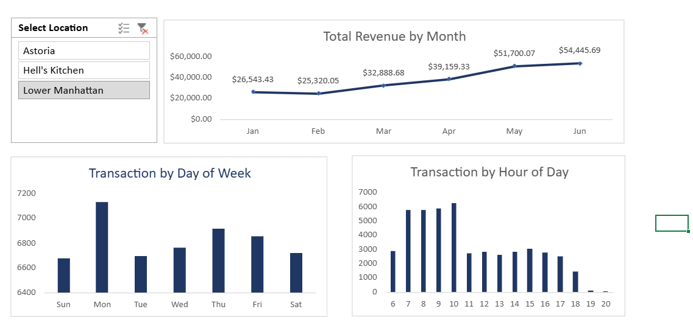
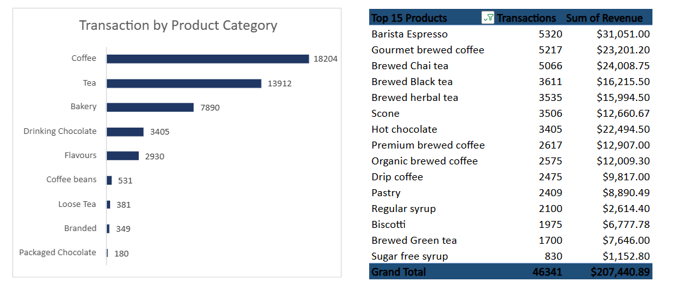

# ☕ Coffee Shop Sales Analysis

> **Comprehensive data analysis of coffee shop sales patterns, customer behavior, and business performance insights**



## 📋 Project Overview

This project provides an in-depth analysis of coffee shop sales data to uncover actionable insights about customer behavior, sales patterns, and business performance. The analysis combines transaction-level data with interactive Excel dashboards to deliver comprehensive business intelligence.



### 🎯 **Key Objectives**
- Analyze sales trends and seasonal patterns
- Identify peak performance periods and customer preferences
- Optimize product offerings and pricing strategies
- Provide actionable recommendations for business growth

## 📊 Dataset & Tools

| **Aspect** | **Details** |
|------------|-------------|
| **Primary Data** | `data/Coffee Shop Sales(Transactions).csv` |
| **Dashboard** | `dashboard/Coffee Shop Sales.xlsx` |
| **Analysis Tool** | Microsoft Excel with Advanced Analytics |
| **Data Volume** | [Add number of transactions] |
| **Time Period** | [Add specific date range] |

### 🔍 **Data Structure**
- **Transaction Details:** Date, time, transaction ID, total amount
- **Product Information:** Item categories, product names, pricing
- **Customer Metrics:** Purchase patterns, frequency analysis
- **Store Operations:** Peak hours, daily performance, staff optimization

## 📈 Key Insights & Findings

### 💰 **Sales Performance**


- **Peak Revenue Period:** [Add your finding]
- **Average Transaction Value:** $[Add value]
- **Daily Sales Pattern:** [Add pattern insight]
- **Monthly Growth Rate:** [Add percentage]

### ☕ **Product Analysis**


- **Top-Selling Items:** [List top 3 products]
- **Most Profitable Category:** [Add category]
- **Price Optimization Opportunities:** [Add insights]

### 👥 **Customer Behavior**


- **Peak Hours:** [Add time range]
- **Average Visit Frequency:** [Add frequency]
- **Customer Preferences:** [Add preferences]

### ⏰ **Operational Insights**


- **Busiest Days:** [Add days]
- **Staff Optimization:** [Add recommendations]
- **Inventory Insights:** [Add insights]

## 🎨 Interactive Dashboard Features


### 📊 **Dashboard Components**
1. **Executive Summary**
   - Real-time KPI tracking
   - Revenue and profit metrics
   - Performance indicators

2. **Sales Analytics**
   - Time-series trend analysis
   - Comparative period analysis
   - Seasonal pattern identification

3. **Product Performance**
   - Category-wise revenue breakdown
   - Product popularity rankings
   - Pricing strategy insights

4. **Customer Analytics**
   - Purchase behavior patterns
   - Customer segmentation
   - Loyalty analysis

5. **Operational Intelligence**
   - Hour-by-hour performance
   - Staff efficiency metrics
   - Resource optimization

### 🔧 **Interactive Features**
- **Dynamic Filters:** Date range, product category, time period
- **Drill-down Analysis:** Click-through detailed insights
- **Real-time Updates:** Automatic data refresh capabilities
- **Export Options:** PDF reports and data extracts

## 🚀 Business Recommendations

### 📈 **Revenue Optimization**
1. **Peak Hour Staffing:** [Add specific recommendation]
2. **Product Mix Strategy:** [Add recommendation]
3. **Pricing Optimization:** [Add recommendation]

### 🎯 **Customer Experience**
1. **Service Timing:** [Add recommendation]
2. **Product Availability:** [Add recommendation]
3. **Customer Engagement:** [Add recommendation]

### ⚡ **Operational Efficiency**
1. **Inventory Management:** [Add recommendation]
2. **Staff Scheduling:** [Add recommendation]
3. **Cost Optimization:** [Add recommendation]

## 🛠️ Technical Implementation

### **Tools & Technologies**
- **Primary Analysis:** Microsoft Excel 2024
- **Data Processing:** Advanced Excel Functions, Pivot Tables
- **Visualization:** Excel Charts, Conditional Formatting
- **Dashboard Design:** Interactive Slicers, Dynamic Charts

### **Analysis Techniques**
- Descriptive Statistics
- Trend Analysis
- Correlation Analysis
- Time Series Analysis
- Customer Segmentation

## 📁 Project Structure

```
coffee-shop-sales/
├── README.md                           # Project documentation
├── data/
│   └── Coffee Shop Sales(Transactions).csv    # Raw transaction data
├── dashboard/
│   └── Coffee Shop Sales.xlsx          # Interactive Excel dashboard
└── images/                             # Screenshots and visuals
    ├── dashboard-overview.png
    ├── sales-trends.png
    ├── product-analysis.png
    ├── customer-behavior.png
    ├── operational-insights.png
    └── dashboard-features.png
```

## 🔄 Future Enhancements

### **Phase 2 - Advanced Analytics**
- [ ] Python-based statistical analysis
- [ ] Machine learning predictive models
- [ ] Customer lifetime value analysis
- [ ] Real-time dashboard integration

### **Phase 3 - Business Intelligence**
- [ ] Automated reporting system
- [ ] Mobile dashboard application
- [ ] Integration with POS systems
- [ ] Advanced forecasting models

## � Data Quality & Methodology

### **Data Validation**
- ✅ Complete transaction records
- ✅ Data consistency checks
- ✅ Outlier identification and handling
- ✅ Missing value analysis

### **Analysis Methodology**
1. **Data Cleaning:** Standardization and validation
2. **Exploratory Analysis:** Pattern identification
3. **Statistical Analysis:** Trend and correlation analysis
4. **Visualization:** Interactive dashboard creation
5. **Insight Generation:** Business recommendation development

## 📞 Contact & Collaboration

Interested in discussing this analysis or exploring collaboration opportunities? 

**Connect with me:**
- 📧 Email: [Your email]
- 💼 LinkedIn: [Your LinkedIn]
- 🐙 GitHub: [Your GitHub profile]

---

### 📅 **Project Timeline**
- **Data Collection:** [Date]
- **Analysis Phase:** [Date]
- **Dashboard Development:** [Date]
- **Documentation:** October 2025
- **Presentation Ready:** ✅ Complete

### 🏆 **Skills Demonstrated**
`Data Analysis` • `Business Intelligence` • `Excel Advanced` • `Dashboard Design` • `Statistical Analysis` • `Data Visualization` • `Business Strategy` • `Performance Optimization`

---

> *This project showcases comprehensive data analysis capabilities and demonstrates practical application of business intelligence techniques for real-world decision making.*